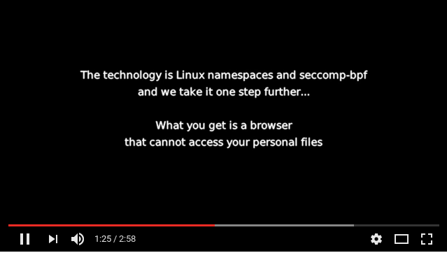

# Firejail
[](https://travis-ci.org/netblue30/firejail)

Firejail is a SUID sandbox program that reduces the risk of security breaches by restricting
the running environment of untrusted applications using Linux namespaces, seccomp-bpf
and Linux capabilities. It allows a process and all its descendants to have their own private
view of the globally shared kernel resources, such as the network stack, process table, mount table.
Firejail can work in a SELinux or AppArmor environment, and it is integrated with Linux Control Groups.

Written in C with virtually no dependencies, the software runs on any Linux computer with a 3.x kernel
version or newer. It can sandbox any type of processes: servers, graphical applications, and even
user login sessions. The software includes sandbox profiles for a number of more common Linux programs,
such as Mozilla Firefox, Chromium, VLC, Transmission etc.

The sandbox is lightweight, the overhead is low. There are no complicated configuration files to edit,
no socket connections open, no daemons running in the background. All security features are
implemented directly in Linux kernel and available on any Linux computer.

[](http://www.youtube.com/watch?v=Yk1HVPOeoTc)


Project webpage: https://firejail.wordpress.com/

Download and Installation: https://firejail.wordpress.com/download-2/

Features: https://firejail.wordpress.com/features-3/

Documentation: https://firejail.wordpress.com/documentation-2/

FAQ: https://firejail.wordpress.com/support/frequently-asked-questions/

Travis-CI status: https://travis-ci.org/netblue30/firejail


## Compile and install
`````
$ git clone https://github.com/netblue30/firejail.git
$ cd firejail
$ ./configure && make && sudo make install-strip
`````
On Debian/Ubuntu you will need to install git and a compiler:
`````
$ sudo apt-get install git build-essential
`````


## Running the sandbox

To start the sandbox, prefix your command with “firejail”:

`````
$ firejail firefox            # starting Mozilla Firefox
$ firejail transmission-gtk   # starting Transmission BitTorrent
$ firejail vlc                # starting VideoLAN Client
$ sudo firejail /etc/init.d/nginx start
`````
Run "firejail --list" in a terminal to list all active sandboxes. Example:
`````
$ firejail --list
1617:netblue:/usr/bin/firejail /usr/bin/firefox-esr
7719:netblue:/usr/bin/firejail /usr/bin/transmission-qt
7779:netblue:/usr/bin/firejail /usr/bin/galculator
7874:netblue:/usr/bin/firejail /usr/bin/vlc --started-from-file file:///home/netblue/firejail-whitelist.mp4
7916:netblue:firejail --list
`````

## Desktop integration

Integrate your sandbox into your desktop by running the following two commands:
`````
$ firecfg --fix-sound
$ sudo firecfg
`````

The first command solves some shared memory/PID namespace bugs in PulseAudio software prior to version 9.
The second command integrates Firejail into your desktop. You would need to logout and login back to apply
PulseAudio changes.

Start your programs the way you are used to: desktop manager menus, file manager, desktop launchers.
The integration applies to any program supported by default by Firejail. There are about 250 default applications
in current Firejail version, and the number goes up with every new release.
We keep the application list in [/usr/lib/firejail/firecfg.config](https://github.com/netblue30/firejail/blob/master/src/firecfg/firecfg.config) file.

## Security profiles

Most Firejail command line options can be passed to the sandbox using profile files.
You can find the profiles for all supported applications in [/etc/firejail](https://github.com/netblue30/firejail/tree/master/etc) directory.

If you keep additional Firejail security profiles in a public repository, please give us a link:

* https://github.com/chiraag-nataraj/firejail-profiles

* https://github.com/triceratops1/fe

Use this issue to request new profiles: [#1139](https://github.com/netblue30/firejail/issues/1139)
`````

`````
# Current development version: 0.9.51

## Whitelisting /var

Add "include /etc/firejail/whitelist-var-common.inc" to an application profile and test it. If it's working,
send a pull request. I did it so far for some more common applications like Firefox, Chromium etc.

## Profile build  tool
`````
$ firejail --build appname
`````
The command builds a whitelisted profile. If /usr/bin/strace is installed on the system, it also
builds a whitelisted seccomp profile. The program is run in a very relaxed sandbox,
with only --caps.drop=all and --nonewprivs. Programs that raise user privileges are not supported
in order to allow strace to run. Chromium and Chromium-based browsers will not work.

Example:
`````
$ firejail --build /usr/bin/vlc ~/Videos/test.mp4

[...]

############################################
# /usr/bin/vlc profile
############################################
# Persistent global definitions
# include /etc/firejail/globals.local

### basic blacklisting
include /etc/firejail/disable-common.inc
# include /etc/firejail/disable-devel.inc
include /etc/firejail/disable-passwdmgr.inc
# include /etc/firejail/disable-programs.inc

### home directory whitelisting
whitelist ~/Videos
whitelist ~/.local/share/vlc
whitelist ~/.config/vlc
include /etc/firejail/whitelist-common.inc

### filesystem
private-tmp
private-dev
private-etc vdpau_wrapper.cfg,udev,drirc,fonts,xdg,gtk-3.0,machine-id,selinux,
whitelist /var/lib/menu-xdg
# private-bin vlc,

### security filters
caps.drop all
nonewprivs
seccomp
# seccomp.keep futex,poll,rt_sigtimedwait,ioctl,fdatasync,read,writev,sendmsg,sendto,write,recvmsg,mmap,mprotect,getpid,stat,clock_nanosleep,munmap,close,access,lseek,fcntl,open,fstat,lstat,brk,rt_sigaction,rt_sigprocmask,rt_sigreturn,madvise,shmget,shmat,shmctl,alarm,socket,connect,recvfrom,shutdown,getsockname,getpeername,setsockopt,getsockopt,clone,execve,uname,shmdt,flock,ftruncate,getdents,rename,mkdir,unlink,readlink,chmod,getrlimit,sysinfo,getuid,getgid,geteuid,getegid,getresuid,getresgid,statfs,fstatfs,prctl,arch_prctl,sched_getaffinity,set_tid_address,fadvise64,clock_getres,tgkill,set_robust_list,eventfd2,dup3,pipe2,getrandom,memfd_create
# 76 syscalls total
# Probably you will need to add more syscalls to seccomp.keep. Look for
# seccomp errors in /var/log/syslog or /var/log/audit/audit.log while
# running your sandbox.

### network
protocol unix,netlink,
net none

### environment
shell none
$
`````

## New command line options
`````
      --writable-run-user
              This    options    disables   the   default   blacklisting   of
              run/user/$UID/systemd and /run/user/$UID/gnupg.

              Example:
              $ sudo firejail --writable-run-user
`````

## New profiles:

terasology, surf, rocketchat, clamscan, clamdscan, clamdtop, freshclam, xmr-stak-cpu,
amule, ardour4, ardour5, brackets, calligra, calligraauthor, calligraconverter,
calligraflow, calligraplan, calligraplanwork, calligrasheets, calligrastage,
calligrawords, cin, dooble, dooble-qt4, fetchmail, freecad, freecadcmd, google-earth,
imagej, karbon, kdenlive, krita, linphone, lmms, macrofusion, mpd, natron, Natron,
ricochet, shotcut, teamspeak3, tor, tor-browser-en, Viber, x-terminal-emulator, zart,
conky
